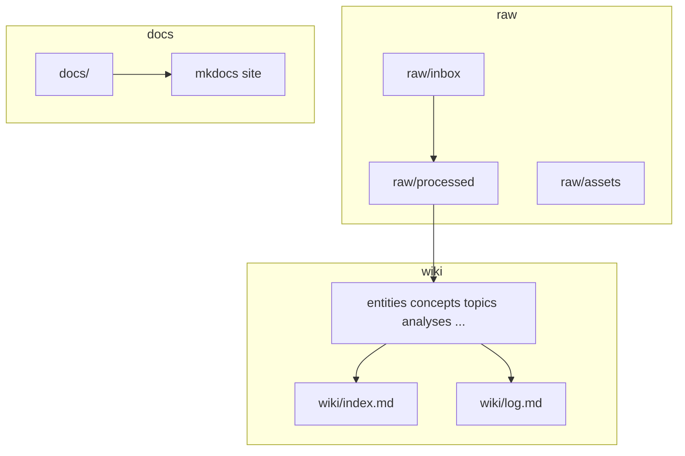

# Architecture

Local-first: **Obsidian** over `wiki/` + `raw/`. **`docs/`** is the operator handbook and optional public mirror.

## Layers

| Layer | Path | Role |
|-------|------|------|
| Evidence | `raw/` | Provenance; no silent edits after filing |
| Synthesis | `wiki/` | Maintained model + routing |
| Handbook | `docs/` | How-to; not the live wiki |

## Hierarchy

1. Obsidian (local repo)
2. `wiki/` + `raw/`
3. `AGENTS.md`
4. GitHub (review)
5. Pages (optional public handbook)

## Operator loop

1. **`wiki/index.md`** → pick cluster
2. Work in `raw/` + `wiki/`
3. Update `wiki/index.md` / hubs
4. Append **`wiki/log.md`**
5. `make validate`

CI runs the same gates as `make check` (see [`validation.md`](operations/validation.md)).

**Next:** [`operations/obsidian.md`](operations/obsidian.md).
